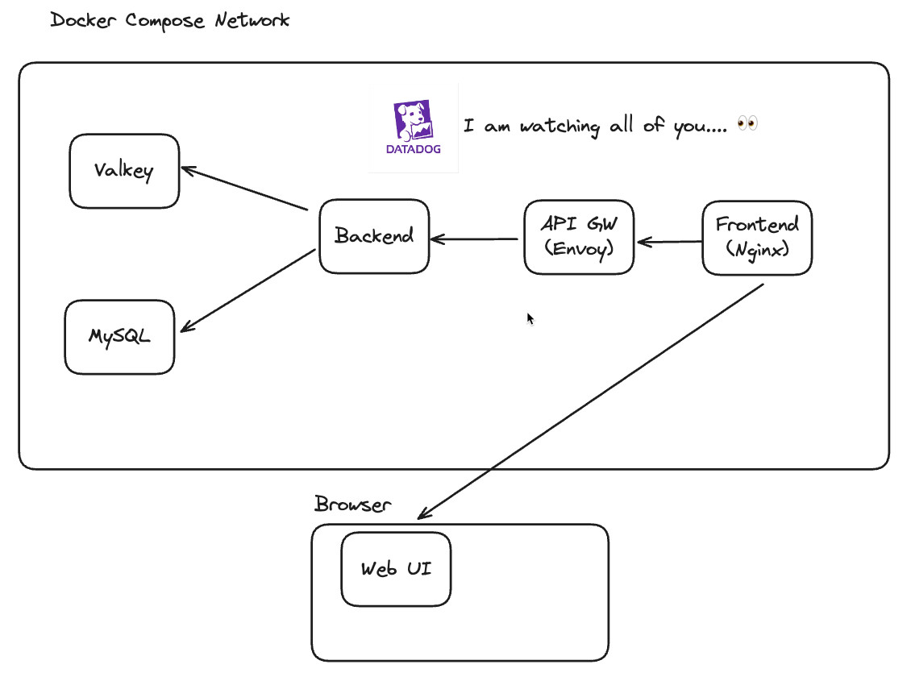

# ddfeed

## Overview

This is a simple web application that enables you to test Datadog products such as APM, DBM, Logs, RUM, etc.



## Getting Started

Write your own configs or credentials to `.env` file.

```bash
cp .template.env .env
```

> [!CAUTION]
> Don't use `docker compose up` or `docker compose build`.
> You can use other `docker compose` commands for checking the app status, logs or executing commands in the containers.

Run all applications. You must use this script to run all services.

```bash
# If you want to try Datadog Tracer.
./run.sh dd

# If you want to try OTel Tracer.
./run.sh otel
```

## Services

### Frontend Service

- Nginx-based web server serving the UI.
- RUM Automatic instrumentation is enabled.

### Envoy Proxy

- Acts as an API Gateway
- Routes requests from UI to Backend service
- Technically, we don't need this service, but it's useful for understanding the proxy tracing.

### Backend Service

- Go-based REST API service providing endpoints for post and comment management.
- Supports both Datadog and OpenTelemetry tracing. You can switch the tracer by `./run.sh dd` or `./run.sh otel`.

### MySQL Database

- Stores posts and comments

### Valkey Cache

- Used for caching post contents and comment counts

### Datadog Agent

- Collects traces, logs, and metrics from the containers.
- DBM is enabled for MySQL.
